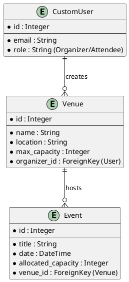

# Event Ticketing & QR Validation Platform
## Version 1: Event & Venue Setup - Implementation Plan

### 1. Objective
Establish the foundational data layer. Version 1 ensures that Organizers and Attendees exist as distinct entities in the system. It allows Organizers to create Venues and schedule Events, enforcing strict mathematical constraints so an event's ticket allocation never exceeds the physical capacity of the venue.

### 2. Tech Stack & Tools
* **Language:** Python 3.10+
* **Framework:** Django (latest stable 5.x)
* **Database:** SQLite (Django default)
* **Architecture Pattern:** MVT (Model-View-Template), though V1 relies heavily on Django Admin for the "View" portion.

### 3. V1 Directory Structure
Once V1 is complete, your workspace will look like this:

```text
ticketing_platform/
├── manage.py
├── requirements.txt
├── core/                      # Main project configuration
│   ├── settings.py
│   ├── urls.py
│   └── ...
├── users/                     # App: Authentication & Roles
│   ├── models.py              # CustomUser definition
│   ├── admin.py               # User admin registration
│   └── ...
└── events/                    # App: Venues & Events
    ├── models.py              # Venue, Event definitions
    ├── admin.py               # Event/Venue admin registration
    └── ...
```

### 4. UML Entity Relationship (V1 Scope)



### 5. Implementation Steps

#### Step 1.1: Custom User Model & Roles

**Objective:** Replace Django's default user model with a custom one tailored for our platform, utilizing email for login and defining specific roles.

- **Files to Create/Modify:** `users/models.py`, `users/admin.py`, `core/settings.py`

- **Tasks:**
  - Create a `CustomUser` model inheriting from `AbstractUser`.
  - Add a `role` field using text choices (Organizer, Attendee).
  - Update `settings.py` to point `AUTH_USER_MODEL` to `users.CustomUser`.
  - Create the initial database migrations.

#### Step 1.2: Venue and Event Models

**Objective:** Build the core models for hosting events, ensuring data integrity at the database level.

- **Files to Create/Modify:** `events/models.py` (Need to run `python manage.py startapp events` first)

- **Tasks:**
  - Define the `Venue` model with `max_capacity`.
  - Define the `Event` model linking to `Venue` via ForeignKey.
  - Override the `clean()` method in the `Event` model to raise a `ValidationError` if `allocated_capacity > venue.max_capacity`.

#### Step 1.3: Admin Interface and Testing

**Objective:** Expose the models to the Django Admin panel to manually test our constraints and workflow.

- **Files to Create/Modify:** `events/admin.py`

- **Tasks:**
  - Register `Venue` and `Event` with custom `ModelAdmin` classes to display relevant columns.
  - Create a superuser.
  - Log into the admin panel, create a Venue, and attempt to create an Event that exceeds the Venue's capacity to verify the constraint logic works.
